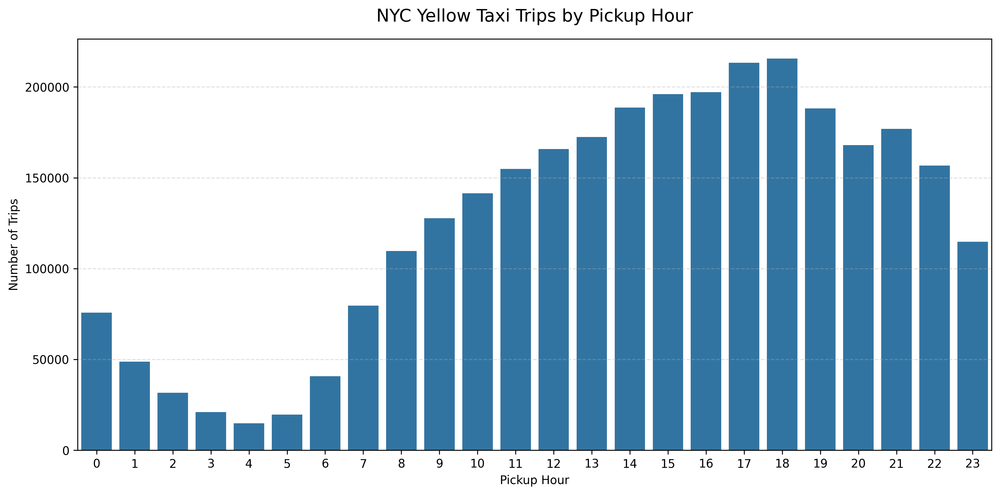

# 🚕 NYC Yellow Taxi 데이터 분석 최종 보고서

**보고서 생성 일시:** 2026-07-21 21:05:46

---

## 1. 🚀 데이터 준비 및 로딩 성능
- **Pandas 로딩 시간:** 0.1230초
- **Polars 로딩 시간:** 0.0532초
- **데이터 정제 결과:** 4,090,836행 $\rightarrow$ 3,106,829행 (총 984,007건 제거)

---

## 2. 📊 기술통계 및 상관관계
### 주요 수치 요약
       trip_distance   fare_amount  ...  total_amount  passenger_count
count   3.106829e+06  3.106829e+06  ...  3.106829e+06     3.106829e+06
mean    3.392683e+00  2.042119e+01  ...  3.010025e+01     1.247952e+00
std     6.203390e+00  1.974366e+01  ...  2.408151e+01     6.327273e-01
min     0.000000e+00  1.000000e-02  ...  1.010000e+00     1.000000e+00
25%     1.000000e+00  9.300000e+00  ...  1.686000e+01     1.000000e+00
50%     1.700000e+00  1.420000e+01  ...  2.238000e+01     1.000000e+00
75%     3.390000e+00  2.330000e+01  ...  3.282000e+01     1.000000e+00
max     5.071010e+03  5.525990e+03  ...  5.530740e+03     9.000000e+00

[8 rows x 5 columns]

### 변수 간 상관계수
                 trip_distance  ...  passenger_count
trip_distance         1.000000  ...         0.015304
fare_amount           0.592909  ...         0.049975
tip_amount            0.361954  ...         0.040851
total_amount          0.597513  ...         0.055093
passenger_count       0.015304  ...         1.000000

[5 rows x 5 columns]

---

## 3. 📈 데이터 시각화 결과

### 🕒 시간대별 운행 건수 (Seaborn 정적 차트)

### 📍 거리 vs 요금 관계 (Plotly 인터랙티브 차트)
[👉 인터랙티브 차트 확인하기](outputs/html/distance_vs_total_amount.html)

---

## 4. 🧪 통계 검정 (t-test)
**주제: 결제 수단별 총 요금 차이 검정**

- **t-통계량:** 107.1476
- **p-value:** 0
- **최종 해석:** p-value(0.000000) < α(0.05) → 귀무가설 기각. 두 결제수단의 평균 총요금은 통계적으로 유의미한 차이가 있으며, 평균적으로 '신용카드' 결제 트립의 총요금이 더 높다.

---

## 5. 🤖 머신러닝 모델링 (ML Pipeline)
### 모델 성능 결과
- **모델 종류:** SGDClassifier Pipeline
- **정확도 (Accuracy):** 0.8743
- **F1-score:** 0.8158
- **ROC-AUC:** 0.5581

### 모델 저장 정보
- **저장 경로:** `models/taxi_classifier_pipeline.joblib`

---
*본 보고서는 데이터 분석 파이프라인에 의해 자동으로 생성되었습니다.*